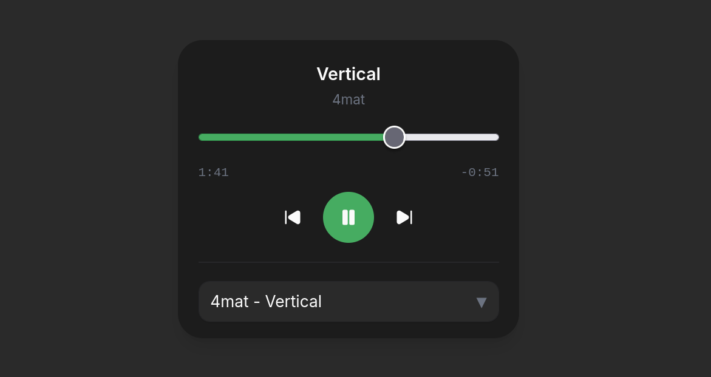

# keygen.mp3

A (work in progress) music player for Chiptune music from those classic Keygen software! (Or any music in .mod, .xm, .s3m, .it formats really, I just felt inspired by [keygenmusic.tk](https://keygenmusic.tk/#) and wanted to make my own :'3)

## Notes
- I'm aware that the UI is... a bit small. On desktops I'd suggest using 140% zoom in the meantime
- Also... the progress bar only looks 100% right on Firefox: Chrome is weird... i cant seem to get the progressed part of the range input to be green (ahem, `var(--player-accent)`) for some reason :p
- Uhhhh some songs wont play properly i have to fix that
- ik the ui is not 100% smooth but its good enough

## Credits

- DrSnuggles/chiptune ([github.com](https://github.com/DrSnuggles/chiptune)) - chiptune library, essential pillar of the app
- Essential Keygen Music by RobWelch ([archive.org](https://archive.org/details/essential-keygen-music)) - keygen library #1
- sxiii/keygen-music ([github.com](https://github.com/sxiii/keygen-music/)) - keygen library #2
- freeCodeCamp/coderadio-client ([github.com](https://github.com/freeCodeCamp/coderadio-client)) - visualizer port derived from here

---

### AI Notice

This project uses AI in assistance to real human code: for bug-fixing, helping understand undocumented libraries and some assistance with some new additions.