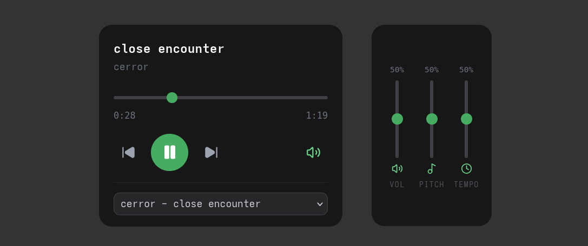

# keygen.mp3

A (work in progress) music player for Chiptune music from those classic Keygen software! (Or any music in .mod, .xm, .s3m, .it formats really, I just felt inspired by [keygenmusic.tk](https://keygenmusic.tk/#) and wanted to make my own :'3)

I'm aware that the UI is... a bit small. On desktops I'd suggest using 150% zoom in the meantime

## Credits

- DrSnuggles/chiptune ([github.com](https://github.com/DrSnuggles/chiptune))
- Essential Keygen Music ([archive.org](https://archive.org/details/essential-keygen-music))

---

### AI Notice

This project uses AI in assistance to real human code, as in:
- Cleaning up code
- Reorganizing code
- Fixing errors
- *Some* additions
- Making code better

ill try to rewrite without ai at some point trust